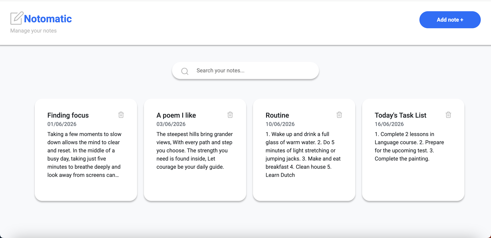
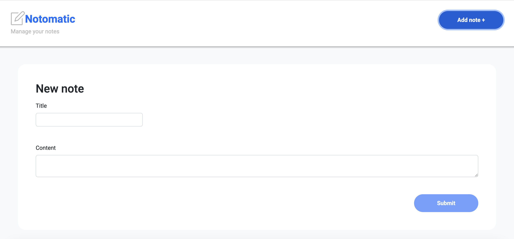
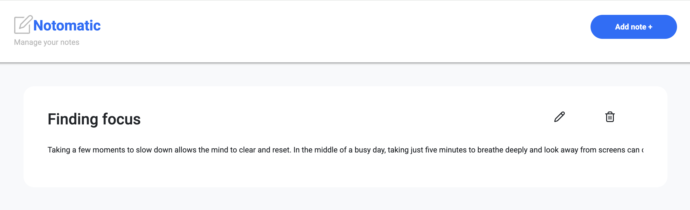
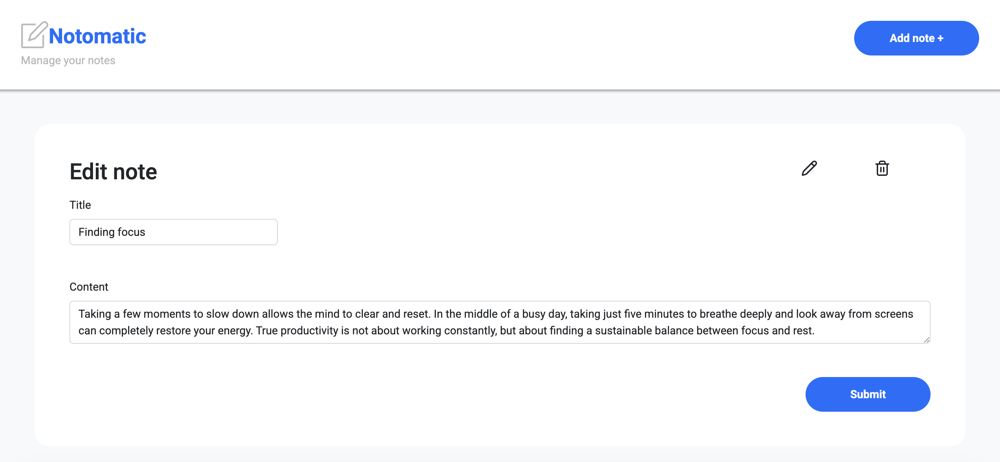

# React notes manager - Notomatic

Notomatic is an note-taking application built with Vite and React that helps users organize their notes with ease. It allows users to create, edit, manage, and delete notes easily.

## Preview of the App

### Browse Notes:

Browse all the notes in one place and quickly find them using the search bar.



### Creating a new note:

Click on the "Add Note +" button to create a new note.



### Viewing existing note:

Open and view exisitng notes by clicking on the note preview card from the browse page.



### Editing existing note:

Click on the pen icon in the note view to edit and update the note.



### Deleting a note:

Delete notes directly from the browse page using the delete icon or from the note viewing page.

## Getting Started:

Follow these steps to run the project locally:

### 1. Install dependencies

```bash
npm install
```

### 2. Start the development server

```bash
npm run dev
```

### 3. Install JSON Server (if not installed globally)

```bash
npm install -g json-server
```

### 4. Start the mock backend server

```bash
npm run dev-server
```

## Tech Stack

* React
* Vite
* JSON Server
* JavaScript
* CSSnpm run dev-server